<p align="center">
  
</p>

<p align="center">
  <a href="https://lloyds.cristianexer.dev/"><strong>Explore the building →</strong></a>
  &nbsp; · &nbsp;
  <a href="docs/RESEARCH.md">Architectural references</a>
  &nbsp; · &nbsp;
  <a href="docs/TESTING.md">Verification report</a>
</p>

# Inside Lloyd’s

**Take apart a landmark. Discover how the pieces belong together.**

An interactive architectural explorer of Lloyd’s of London at One Lime Street: orbit the building, separate its external services, reveal the atrium, and inspect the parts that make its inside-out architecture so distinctive.

## Why I made this

I started this as an experiment with **OpenAI Astra 6**. I was trying the capabilities of the latest frontier model available to me in Codex and wanted to see how far I could take a detailed, interactive 3D experience.

Since I work at **Beazley**, a major participant in the Lloyd’s of London insurance market, this building felt like a fun subject to explore. The idea was simple: could a collection of architectural references become a tool that lets you take the building apart and understand how it works?

This is the result: a personal exploration of architecture, code and AI-assisted creation. It is independent of Beazley and Lloyd’s. For context on Beazley’s participation in the market, see [Beazley’s trading overview](https://investor.relations.beazley.com/en-us/broker-centre/trading-with-beazley/).

## What you can discover

| View                    | What happens                                                                                                                                                             |
| ----------------------- | ------------------------------------------------------------------------------------------------------------------------------------------------------------------------ |
| **Exterior → Exploded** | The vault lifts in sections, façades pull away, stairs and services separate, and galleries spread. Optional connection guides link pieces to their assembled positions. |
| **Cutaway**             | A movable section reveals the atrium and trading floors, with warm section faces on closed solid geometry.                                                               |
| **Floors**              | Choose a level and hide the floors above, or retain them as a faint ghost for context.                                                                                   |
| **Building anatomy**    | Search 17,732 addressable elements; inspect, frame, isolate, hide or explore a related system.                                                                           |
| **Guided tour**         | Six short stops introduce the architectural ideas and return the model to its assembled form.                                                                            |
| **Inside the market**   | A fictional placement journey explains the relationship between clients, brokers and underwriters.                                                                       |

The model includes six service-tower groups, D-shaped stair casings, porthole service pods, meeting-room pods, exposed risers, plant rooms, maintenance cranes, the vaulted atrium, galleries, escalators, underwriting boxes, the Rostrum and Bell, and an interpreted street-level setting with entrances and air intakes.

**Entirely in the browser.** React · TypeScript · Vite · Three.js · React Three Fiber · Drei · Zustand. No backend, login, runtime AI, API key or remote media service is required. Astra was used during creation; the deployed app does not call a model.

## Run locally

Node.js **22.16 or later** recommended. Package versions are pinned and the npm lockfile is included.

```sh
npm ci
npm run dev
```

Open the local address printed by Vite, normally `http://localhost:5173`.

```sh
npm test             # Core state, model and explosion invariants
npm run build        # Regenerates metadata, checks TypeScript, produces dist/
npm run preview      # Serve the production build
```

## Explore

- Orbit with a drag; pan with right-drag or two fingers; zoom with the wheel or a pinch.
- Use **Exterior** to scrub the assembled/exploded model. Roof sections lift, façades move away, service assemblies separate and galleries spread. The camera expands its framing with the diagram.
- **Cutaway** moves a vertical section through the building. **Floors** hides or ghosts levels above the chosen gallery. Both reassemble first and make explosion unavailable explicitly.
- Search **Building anatomy**, expand a system and assembly, or click/tap a rendered part. The information panel provides geometry status, purpose and source links.
- **Frame**, **Isolate**, **Hide**, **Related system** and **Restore all** work with component, assembly or system IDs. **Reset view** restores the model and camera together.
- The six-stop guided tour is skippable. Camera presets include exterior elevations, the roof, atrium and Underwriting Room.
- **Inside the market** offers a fictional placement journey and a separate explanation of organisational relationships. Select the on-scene hotspots or the equivalent panel controls.
- Focus the canvas to use arrow-key orbit, `+` / `−` zoom and `Home` reset. `/` focuses search. All essential component actions are also available in the text catalogue.
- Reduced motion follows the system preference and can be toggled. The text catalogue remains usable when WebGL is unavailable or its context is lost.

## Model and provenance

The model is generated locally by [`src/model/building.ts`](src/model/building.ts). It contains **17,732 individually addressable elements**, **39 assemblies** and **seven systems**, rendered in instanced batches. Counts describe selectable model details, not a count of real building parts.

```sh
npm run model:manifest
```

This reproduces the complete logical **Building → System → Assembly → Component** tree in `public/data/components.json` and source records in `public/data/sources.json`. Building generation also runs directly in the app; no GLB download is needed. Rendering batches do not erase the logical hierarchy or instance IDs.

- [`public/asset-manifest.json`](public/asset-manifest.json): assets, attribution, licence information and rejected asset-search candidate.
- [`docs/RESEARCH.md`](docs/RESEARCH.md): primary sources and modelling decisions.
- [`docs/INTERACTIONS.md`](docs/INTERACTIONS.md): state, visibility, animation and rendering contracts.
- [`docs/TESTING.md`](docs/TESTING.md): checks, measured performance and limitations.

The exterior, footprint, orientation, service routes and dimensions are **approximate reference-based reconstructions**. Interior furniture, stair/escalator details and the Rostrum/Bell are illustrative. The model does not reproduce current box allocations or serve as a surveyed digital twin. No supplied reference photographs are redistributed. Lloyd’s is represented as an insurance marketplace, not a bank or a single insurer.

## Browser verification

The repository includes reproducible Playwright checks. Start the dev server or production preview in another terminal first. The Chrome check uses the installed Google Chrome application; install Chrome if absent.

```sh
npm run test:browser
npx playwright install webkit
node scripts/webkit-check.mjs
```

Set `TEST_URL` to test another local/deployed address. Screenshots and JSON results go to ignored `output/playwright/`. Core tests do not require a browser. A production check can use `TEST_URL=http://localhost:4173 npm run test:browser` after `npm run preview`.

## Publish with GitHub Pages

The live explorer is hosted at **[lloyds.cristianexer.dev](https://lloyds.cristianexer.dev/)**.

Every push to `main` runs [the Pages workflow](.github/workflows/pages.yml): install the lockfile, run the core tests, read the configured Pages address and build for its path, upload `dist/`, and deploy to the `github-pages` environment. The workflow can also be run manually from Actions.

For a fork, enable **Settings → Pages → Source → GitHub Actions**. The workflow reads the Pages configuration before building: a custom domain uses `/`; a project hosted on `github.io` uses its repository subpath. No hardcoded repository path needs changing. Vite’s [static deployment guide](https://vite.dev/guide/static-deploy#github-pages) explains the base-path distinction.

To reproduce the current custom-domain build locally, use `npm run build`. To check a repository-subpath deployment instead:

```sh
VITE_BASE_PATH=/Lloyds-of-London-3D-building/ npm run build
VITE_BASE_PATH=/Lloyds-of-London-3D-building/ npm run preview
# Open http://localhost:4173/Lloyds-of-London-3D-building/
```

## Deploy to Vercel

Import this repository into Vercel and use the **Vite** preset. `vercel.json` supplies the build command (`npm run build`) and output directory (`dist`). No environment variables or server functions are needed. Alternatively, upload `dist/` to any static web host. All runtime assets are local build outputs.

The same app can be built for a root-domain host without the Pages environment variable.

## Source layout

```text
src/model/          Pure procedural geometry, hierarchy, types and explosion maths
src/data/           Structured public sources
src/store.ts        Central interaction state and visibility rules
src/components/     Instanced scene, camera, panels, tour and market lesson
scripts/            Metadata exporter and repeatable browser checks
tests/              Core interaction and model invariants
public/             Favicon, asset manifest and generated catalogue
```

`npm run format` formats source and documentation. There are no photographic textures to fetch, no CDN font requests, and no unlicensed imported building meshes.

## The animated banner

The README illustration is an original SVG generated from the model itself, with a small CSS animation that separates and reassembles its components. It has no external assets or scripts and honours reduced-motion preferences.

```sh
node --import tsx scripts/generate-banner.ts
```

The banner is a compact interpretation; the live explorer contains the full geometry. Reference photographs remain outside the repository.
